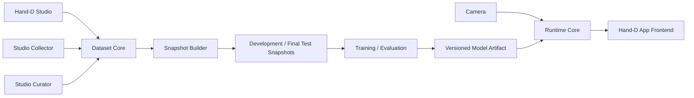
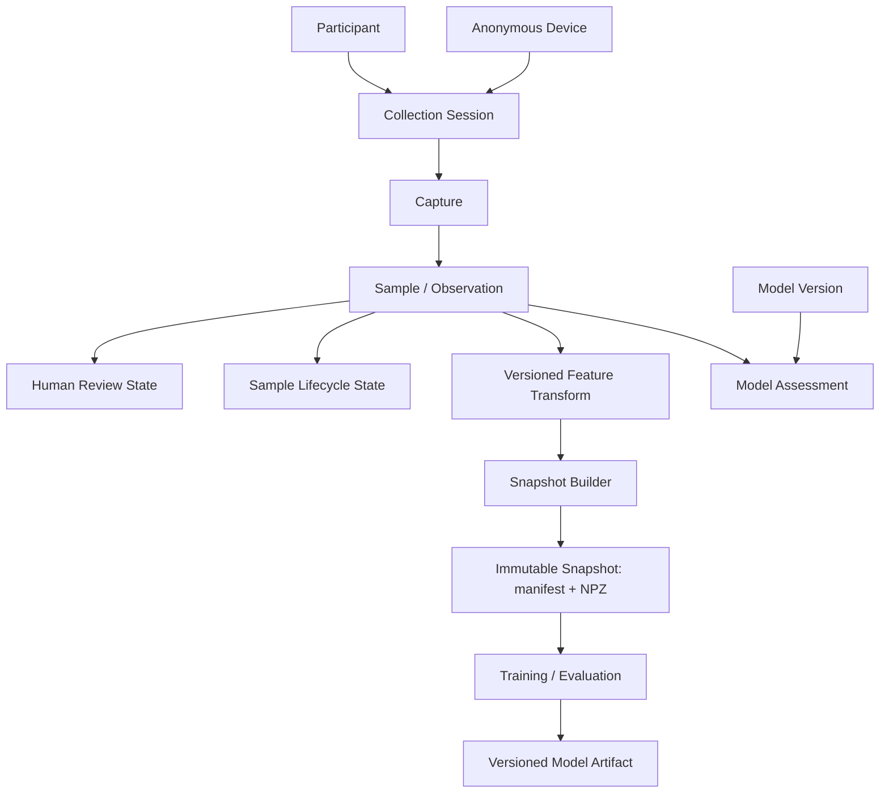

# Hand-D Architecture Reference

## Alcance

This reference separates **verified current architecture** from the **target v2 boundaries**. Target sections are design direction, not claims that the code already implements them.

## Estado actual

### Runtime application

`visualizer_app/main.py` owns the Tkinter application, user configuration, UI tick loop, camera/canvas rendering, and lifecycle of `GestureEngine`.

`visualizer_app/gesture_engine.py` currently owns:

- webcam capture;
- MediaPipe Hand Landmarker creation;
- per-frame synchronous `detect(...)`;
- handedness correction and drawing/modifier role assignment;
- landmark canonicalization;
- PyTorch gesture inference;
- delivery of `GestureResult` to the UI.

The current classifier is a 69 → 128 → 64 → 5 MLP. Its runtime backend is CUDA when `torch.cuda.is_available()`, otherwise CPU.

### Data collection

`dataset_extraction_tools/data_extractor.py` captures webcam frames, processes every configured stride, canonicalizes a detected hand, and appends feature rows to a CSV. The CSV stores 69 features plus handedness and label.

The collector currently contains inconsistent handedness semantics: filtering compares the requested hand to MediaPipe's raw label, while the feature function separately computes the actual hand as the opposite label after mirror correction.

### Dataset curation

`dataset_extraction_tools/data_view_3d.py` is an interactive Matplotlib viewer/purger over the CSV representation. Its current save path is not a durable curation model; v2 will replace destructive row editing with review-state-driven dataset generation.

### Training

`model_training/gesture_classifier.py` is stale relative to the runtime:

- it defines four classes rather than the current five;
- it performs row-level random splitting;
- its validation loader points to the training subset;
- its CPU fallback expression is invalid;
- it does not provide a reproducible participant/session-aware evaluation protocol.

This file is evidence of technical debt, not a canonical training specification.

## Target v2 boundaries



### Hand-D App

The App is the product surface. It consumes processed runtime results and owns the drawing document/canvas state. Strokes, erasures, color/thickness, undo/redo, current-document state, canvas-coordinate mapping, and pointer smoothing/interpolation are frontend/application concerns; they do not live inside the Python sidecar. The App should not own ML training, dataset curation, or direct knowledge of training storage.

Hand-D is one desktop application with two product spaces:

- **Whiteboard/App** — default destination for drawing and normal runtime use.
- **Studio** — secondary advanced project/data space for workspace/model configuration, collection, curation, and project inspection.

These are navigation/product boundaries, not separate executables. They share the Tauri shell, release lifecycle, runtime supervisor, workspace contract, and compatible Model Artifact system.

### Runtime Core

The runtime owns camera access, MediaPipe processing, shared feature transformation, gesture inference, gesture/tracking stabilization, hardware backend/provider selection, and lifecycle/error states. The App frontend consumes normalized tracking coordinates plus transient gesture/runtime state from this boundary rather than camera-pixel drawing commands.

For the App path, freshness is more important than exhausting every camera frame.

Live camera processing uses MediaPipe Hand Landmarker LIVE_STREAM mode and detect_async with monotonic timestamps. Unlike the current IMAGE/detect loop, the live-stream API is asynchronous and is allowed to ignore incoming frames while the landmarker is busy. This bounded/freshness behavior is intentional: Hand-D must prefer the latest usable gesture state over building a backlog of stale camera frames.

VIDEO mode remains available for decoded/recorded video workloads; it is not the primary webcam runtime because detect_for_video is synchronous. IMAGE mode remains for isolated images/tests.

Conceptually the live path is:

Camera capture -> latest-frame boundary -> MediaPipe LIVE_STREAM -> latest landmark result -> Feature Transform -> gesture inference -> temporal state -> frontend result/events.

Every boundary that can accumulate live work must remain bounded/freshness-oriented rather than becoming an unbounded FIFO. Preview rendering is a separate consumer of the latest camera frame and is never upstream of inference.

The real-time system has three independent cadences:

- **Camera/source cadence**: whatever the selected camera mode actually delivers, probed at runtime rather than assumed.
- **Inference cadence**: MediaPipe/gesture updates, targeting source cadence up to 60 Hz when feasible, with >=30 Hz preferred on capable supported hardware and sustained <20 Hz treated as degraded.
- **Frontend render cadence**: normally 60 Hz on the milestone displays, consuming the latest gesture/tracking state independently from inference frequency.

Hand-D never duplicates camera frames merely to claim 60 FPS and never treats a 60 Hz canvas loop as evidence of 60 Hz inference.

The post-landmarker gesture-response budget is p95 <50 ms preferred and p95 <100 ms as the milestone hard ceiling, measured from a usable MediaPipe result entering Feature Transform through model inference, temporal state, IPC, and frontend state delivery. Camera/sensor latency is recorded separately when reliable capture timestamps are available.

### Tauri + Python sidecar

Tauri/Rust owns the Python sidecar as a long-lived child process. Rust is responsible for spawn, readiness/health, crash/exit observation, log capture, restart policy, and orderly shutdown. Frontend components use application-level commands/events and do not directly own process creation.

Runtime lifecycle is resilient rather than modal. The Tauri shell/frontend is allowed to become interactive before Python, MediaPipe, the model, and camera are fully ready. Runtime-dependent affordances expose preparing/recovering/degraded states while canvas and non-runtime UI remain available.

On unexpected sidecar exit, Rust performs one automatic restart attempt. Frontend/canvas state is not reset as a side effect of restarting Python. If the restarted sidecar reaches READY, normal runtime subscriptions resume; if recovery fails, the shell remains open and exposes an explicit retry action.

Health is modeled by subsystem rather than as one boolean. At minimum the frontend can distinguish sidecar/process health, IPC connection, model readiness, camera availability/permission, and preview state. A camera-specific failure does not imply that the shell, canvas, settings, or already-loaded model metadata must be discarded.

The milestone IPC direction is a loopback HTTP + WebSocket service hosted by Python. HTTP is suitable for request/response operations such as health/configuration and WebSocket carries low-latency runtime events and interactive commands. The service binds only to loopback; the prototype must define dynamic port discovery, per-launch trust/authentication, Tauri capability/CSP scopes, reconnect semantics, protocol versioning, and shutdown behavior.

Endpoint discovery uses OS allocation rather than a fixed port. Python binds to 127.0.0.1:0, reads back the assigned port, and reports it to Tauri/Rust in the sidecar readiness handshake. Tauri/Rust supplies a fresh random launch token to the sidecar and exposes connection information only to the Hand-D frontend/runtime bridge. Restarting the sidecar creates a new endpoint/session rather than assuming that a previous port remains valid.

Each sidecar process is a distinct **Runtime Session**. The session receives a unique runtime_session_id in addition to its endpoint/token. Reconnection after a restart follows this sequence:

1. Rust detects the old process exit and starts a replacement sidecar.
2. The new process binds a new loopback endpoint and reports READY with a new Runtime Session identity.
3. The frontend discards/invalidates the old runtime subscription.
4. The frontend requests a current runtime snapshot: selected camera/status, active model, drawing/modifier hand settings, preview state/capabilities, and subsystem health.
5. The frontend applies that runtime snapshot without touching its drawing document.
6. A new WebSocket subscription begins for the new Runtime Session.

Runtime events carry the session identity plus sequence/timestamp metadata. Any delayed event from an older Runtime Session is ignored. Real-time gesture events are not replayed across process restart: a gesture from the dead process is already stale and cannot improve current interaction.

This localhost service is the Python sidecar API; it is distinct from Tauri's optional localhost plugin for serving frontend assets.

### Camera preview

Both App and Studio may display live camera preview, preserving the current camera-visible/dark-mode product behavior. Studio uses preview as collection feedback; App treats it as an optional presentation mode.

Preview is deliberately independent from control/inference IPC. Python owns the camera once and can fan the latest frame out to MediaPipe and to an optional preview encoder/stream. When no surface subscribes to preview, frame encoding/transport work should stop.

The selected v2 preview path is HTTP MJPEG served directly by the Python sidecar on its authenticated loopback endpoint. The Tauri webview consumes this as an image stream, so frame bytes do not traverse Tauri command/event IPC and do not require application-level JavaScript decoding/reassembly. Preview never shares a backpressure queue with gesture/control events.

MJPEG is tuned/measured on Tiger Lake/CachyOS and Apple Silicon M4. Priority is ordered as gesture latency, tracking/inference stability, visual preview smoothness, then preview resolution/FPS. A dedicated binary WebSocket JPEG stream is retained only as contingency if direct MJPEG later fails an explicit supported-target budget.

Preview cadence is source/capability-driven. If a camera exposes a stable 60 FPS mode and the machine can preserve the gesture-response budget, Hand-D may stream preview at up to 60 FPS. Otherwise the baseline target is a stable 30 FPS and the normal visible-preview floor is 24 FPS. Under load the runtime reduces JPEG quality/resolution first, then preview FPS, and can suspend hidden/minimized preview encoding before compromising gesture freshness.

WebRTC is not the baseline transport for the milestone because Hand-D needs consistent behavior across Tauri's platform webviews and current WebKitGTK 2.54 disables WebRTC while transitioning backends. Codec/MSE/WebCodecs pipelines may become relevant later if high-resolution preview efficiency becomes more important than the simplicity and portability of MJPEG.

The existing project inspirations in README.md — BaranDev/virtual-whiteboard and the dark-mode hand-tracking demo — remain qualitative interaction references. FaceRay is an explicit preview/data-plane architecture inspiration: its Tauri 2 + Python/MediaPipe design keeps CV/video in the Python data plane and serves loopback MJPEG directly to the webview so heavy frame bytes do not cross the control IPC boundary. Hand-D adopts that separation, but FaceRay is not the authority for Hand-D's drawing-state ownership or control protocol; Hand-D retains frontend-owned drawing state and its own HTTP/WebSocket runtime contract.

### Hand-D Studio

Studio is an advanced project/data surface for:

- Project Workspace selection/configuration;
- compatible Model Artifact selection/promotion;
- participant selection;
- collection sessions/captures;
- dataset inspection;
- Suggested for Review;
- accepted/rejected curation plus independent Sample lifecycle/drop management;
- dataset export/preparation.

Training/evaluation should be invokable reproducibly from tooling/CLI for the milestone, but is not required inside the Studio GUI.

Studio is intentionally secondary to the Whiteboard so normal users are not forced to understand dataset/model concepts before drawing. It is not developer-only: technical concepts are progressively disclosed, and both technical and non-technical users may use the same surface at different levels of detail.

The v2 Studio information architecture is:

```text
Studio
├── Overview
├── Collect
├── Dataset
├── Models
└── Workspace
```

Overview summarizes workspace health, Active Model, dataset/review counts, recent Collection Sessions, and runtime/camera health.

Overview is intentionally operational: it answers "what workspace/model am I using, is the runtime healthy, what data/review work is pending, and what should I do next?" rather than duplicating the detailed analytics available under Dataset/Models.

Collect implements the canonical flow:

```text
Participant
  -> Collection Session
    -> Capture setup (gesture, hand, target quota)
      -> Live capture/preview/progress
        -> Pause/Resume/Stop
          -> Complete capture / next gesture / review / end session
```

The operator chooses only the participant, target gesture, hand, and target quota for normal collection. Session/capture IDs, timestamps, anonymous device identity, platform, camera, software versions, and other Collection Provenance are recorded automatically.

Participants are scoped inside Collect. A selected participant starts or resumes the human workflow context, while each new Collection Session remains a distinct provenance boundary. Within that active Session, Collect presents gestures as a Capture checklist so repeated participant/session setup is unnecessary.

The gesture vocabulary is workspace-extensible for collection. A new gesture definition may be created and collected immediately, but the gesture is not a runtime capability merely because rows exist in SQLite. Runtime recognition requires a compatible Model Artifact whose label manifest includes the gesture; using that recognition to trigger a Whiteboard action additionally requires an explicit product/runtime mapping.

Every accepted technical observation persists the canonical 21-point MediaPipe data: 21 normalized image-space x/y/z triples plus 21 world-space x/y/z triples. The 69-value legacy-compatible model input is not what Collect stores as source truth; it is materialized later through Feature Transform v1.

Dataset contains **Browse** and **Review**. Browse exposes filters and summaries over participant/session/capture/gesture/hand/review state. Review exposes Suggested for Review, Accept, Reject, Drop, optional tags/notes, random QC, and deliberate batch acceptance.

Models contains Active Model selection, available compatible artifacts, compatibility/provenance, and evaluation evidence. A **Training & Evaluation** subsection bridges to the reproducible external training workflow for the milestone: it can show the selected snapshot/configuration and produce/copy the exact command or launch aid, while actual training remains CLI/tool-owned. New Model Artifacts are discovered back into Models afterward. This preserves a stable UI location for training today and a natural home for a future GUI-owned training action.

`Models -> Evaluation` renders structured Model Artifact evidence directly in Studio. The default hierarchy is intentionally compact:

- Macro F1 and overall model health;
- per-class precision/recall/F1 summaries;
- confusion matrix;
- learning curve;
- runtime performance summary.

Fold/session metrics, training history, uncertainty distributions, artifact/configuration details, and future calibration diagnostics remain drill-down/advanced material rather than occupying the primary screen.

Raw classifier outputs are described as scores unless calibration evidence exists. Advanced evaluation/review surfaces expose the top-1 score, runner-up score, and top-two margin explicitly. A simplified “confidence” label may be used as UX copy only when it does not imply that raw softmax output is a calibrated probability.

Dataset analytics are likewise action-oriented rather than dashboard-heavy. The default analytics answer:

- which gestures/classes are underrepresented;
- which participant/session/hand combinations are incomplete;
- how many Samples are unreviewed/accepted/rejected/dropped;
- which Capture/session targets are incomplete;
- what collection/review action should happen next.

Coverage matrices and a small number of balance/progress charts support those questions. Exploratory embeddings/dimensionality-reduction visualizations are deferred from the default v2 Studio UX.

### Snapshot Readiness

Before Snapshot Builder creates an immutable Development Snapshot, Studio presents a compact readiness result with two severities:

- **Blocker** — the snapshot would violate an integrity/reproducibility/contract invariant and must not be built yet.
- **Warning** — the snapshot is technically valid, but the data/evaluation coverage deserves attention before committing to the experiment.

Typical blockers include:

- no eligible accepted Samples;
- malformed or incomplete landmark observations;
- invalid participant/session/capture references;
- unavailable required Feature Transform;
- incompatible label/transform contract;
- accidental overlap between development membership and sealed final-test membership.

Typical warnings include:

- a gesture/class is underrepresented;
- a primary participant has fewer independent Sessions than intended;
- opposite-hand verification is small;
- unreviewed Samples remain;
- meaningful class/session/hand imbalance or another analytics-derived collection gap exists.

The readiness layer does not turn collection heuristics into false scientific laws. For example, the current ~100-usable-Sample target may trigger a warning, but snapshot creation is not blocked solely because a class contains fewer observations. Learning-curve evidence remains the mechanism for deciding whether more data is actually needed.

### Snapshot Builder interaction

Snapshot Builder is intentionally narrow. In the normal Studio flow it asks only for decisions that cannot be safely derived:

- snapshot name/description;
- intentionally selected participant/session scope, when the user is not building the normal Development Snapshot;
- legacy inclusion policy when compatible legacy data exists;
- acknowledgement/review of Snapshot Readiness warnings.

Feature Transform identity, label order, fixed fold definitions, seed/reproducibility policy, and exact eligible/excluded Sample membership are derived from the workspace/protocol and shown through Advanced details rather than presented as mandatory knobs.

Snapshot creation is append-only. Once a snapshot ID is allocated and its manifest/materialization is written, Studio never mutates it in place. A revised experiment creates a new snapshot, even when it is conceptually based on an older one.

Normal eligibility is the conjunction of two independent states:

```text
review_status == accepted
AND
lifecycle_status == active
```

Unreviewed Samples are active observations with no human quality decision yet; they are excluded from snapshot membership and contribute a readiness warning until reviewed. Accepting an unreviewed Sample changes only Review Status to accepted. Lifecycle remains active unless the Sample is separately dropped. Rejected Samples fail the quality condition; dropped Samples fail the lifecycle condition.

Workspace uses the desktop operating system's native directory chooser through Tauri for Open/Create operations. A new workspace asks only for a name and target location; Hand-D initializes the config, SQLite store, and expected project directories itself.

### Easy Mode

Easy Mode is disabled by default in v2. It is a presentation policy over the same product/domain model, not a separate application mode with separate storage or behavior. It may:

- prefer human-readable model/workspace labels over artifact IDs;
- hide low-level metrics/IDs/configuration until requested;
- present recommended/default actions prominently;
- collapse advanced runtime/data controls behind explicit disclosure.

Easy Mode must not silently mutate data, bypass Model Artifact compatibility checks, create a different workspace format, or make destructive curation actions less explicit.

The non-Easy default must still be usable by a non-technical user. Easy Mode is a stronger progressive-disclosure layer for people who want fewer metrics, IDs, and tuning controls; it is not a substitute for sound default information architecture.

Whiteboard itself must remain understandable to a non-technical end user without requiring Easy Mode. Easy Mode primarily reduces technical density in Studio and advanced/runtime panels; technical users can leave it disabled to retain direct access to ML/runtime details.

### Dataset Core

The canonical observation is raw landmark data plus provenance and human labeling/review state. The canonical working store is SQLite so Studio can query, curate, and update this state transactionally. A versioned transform produces the feature representation used by a specific model.

Review Status has three values:

- **unreviewed** — no human curation decision yet;
- **accepted** — eligible for future snapshot membership, subject to snapshot rules;
- **rejected** — reviewed and intentionally excluded because the Sample is unsuitable for training.

Sample Lifecycle Status is independent:

- **active** — participates in normal dataset views and may be snapshot-eligible if Review Status is accepted;
- **dropped** — reversible soft delete; hidden from normal active views and excluded from future snapshots while remaining canonical/auditable.

Reject and Drop are intentionally different semantics. Reject changes the human quality decision; Drop changes lifecycle/visibility while preserving that quality decision. Neither physically removes the Sample or its landmarks. Review transitions append Review Events; lifecycle transitions append Lifecycle Events.

Conceptual relationships:



The operator should only need to choose participant, gesture, hand, and collection target. Session IDs, capture IDs, timestamps, anonymous device identity, platform, camera, and relevant versions are generated/recorded automatically.

Canonical landmark storage is relational at the current scale:

```text
samples
└── sample_id

landmarks
├── sample_id
├── landmark_index        # 0..20
├── image_x / image_y / image_z
└── world_x / world_y / world_z
```

One Sample therefore owns exactly 21 landmark rows. This representation is intentionally inspectable and testable; vectorized arrays are produced later by the feature/snapshot pipeline.

### Capture lifecycle

A Capture represents one continuous collection context inside a Collection Session. It may be paused and resumed while that Session remains active. If the Session ends, an incomplete Capture remains partial and a later Session starts a new Capture.

An incomplete Capture that has never been referenced by an immutable snapshot may still be explicitly discarded and physically deleted with its Samples after confirmation. This remains the narrow hard-delete exception. Ordinary per-Sample deletion in Dataset is Drop/soft-delete. Once data is referenced by a snapshot, destructive cleanup must not invalidate the snapshot's ability to reproduce the historical training/evaluation view.

### Feature Transform seam

Feature canonicalization is a shared deep module. Its interface exposes the transform identity/version and the model-ready output contract; mirror correction, translation, scale normalization, canonical-frame rotation, global orientation features, and validation remain implementation details behind the seam.

The current legacy-compatible transform produces the existing 69-value feature contract. New raw Samples can be reprocessed through this transform or through future transforms because their image/world landmarks are preserved. Legacy CSV rows do not have raw landmarks, so they can only participate where their stored 69-feature representation is contract-compatible.

Snapshots reference the Feature Transform contract used to materialize model input; they do not duplicate or expose the transform's internal geometry algorithm.

### Snapshot Builder

Snapshot Builder is the boundary between mutable Dataset Core state and reproducible ML execution. It reads an approved historical view from SQLite, selecting active + accepted Samples according to the snapshot policy, applies the selected Feature Transform exactly once during materialization, and emits an immutable snapshot. Training/evaluation does not query SQLite directly after the snapshot exists.

The milestone snapshot consists conceptually of a manifest.json plus dataset.npz.

The manifest records the snapshot identity, selected Sample membership, participant/session membership, label order, Feature Transform identity/version/output contract, session-validation fold definitions, legacy availability/membership, seed/reproducibility configuration, and source revision/integrity metadata.

The NPZ contains the exact materialized model inputs associated with that manifest, including feature arrays, labels, stable source identifiers, and split/fold metadata needed by training/evaluation. For v2 Samples these arrays are derived from canonical raw landmarks at snapshot creation. Compatible legacy rows remain a separate materialized partition because they have only the existing derived 69-feature contract and cannot be regenerated through future incompatible transforms.

The Development Snapshot is shared across the P001/P002 development protocol. It freezes the v2 development materialization, compatible legacy materialization, and fixed Collection-Session folds. Selecting a fold, choosing legacy=false or legacy=true, and choosing a learning-curve fraction are experiment configuration over this same immutable evidence base rather than separate independently-created datasets.

This guarantees that with-legacy and without-legacy comparisons change the intended variable instead of silently changing validation membership.

Each session-held-out fold may persist its trained fold model/checkpoint with a stable identity so OOF Model Assessments can name the exact model that produced them. Fold models are evaluation artifacts, not Active Model candidates. Once transform/model/legacy/threshold choices are frozen, training performs one final refit over all eligible P001/P002 development Samples (plus legacy only when selected); that final-refit Model Artifact is the promotable runtime candidate.

P003 is never materialized into the Development Snapshot. Once all development/model-selection decisions are frozen, the selected configuration is refit once using all eligible P001/P002 development Samples (plus legacy only if selected by development evidence). Snapshot Builder then creates a separate Final Test Snapshot for P003 and that final candidate is evaluated against it once. P003 does not feed back into milestone training/tuning.

An existing snapshot is self-contained for ML execution. Later SQLite review changes or Feature Transform implementation changes do not alter its manifest or materialized NPZ. New canonical decisions require a new snapshot.

Immutability is enforced by creation semantics rather than filesystem permissions: Snapshot Builder never overwrites an existing snapshot ID. If membership, transform, folds, or materialized content changes, it allocates a new snapshot version.

### Model Artifact

Training output is a versioned bundle rather than an unqualified weights file. PyTorch remains the training baseline, so the canonical training output retains weights.pth. The bundle may also contain a derived deployment representation such as model.onnx when a deployment-runtime prototype accepts it. Conceptually:

```text
model-<id>/
├── weights.pth
├── model.onnx        # optional until ONNX Runtime is selected
├── manifest.json
└── metrics.json
```

The model manifest declares, at minimum:

- model identity and architecture/version;
- artifact role, at minimum distinguishing cross-validation/fold evidence from a final-refit promotable candidate;
- available runtime/deployment format(s) and their compatibility/equivalence evidence;
- Feature Transform identity/version and expected output contract;
- expected input dtype/feature count;
- label mapping/order;
- source Development Snapshot identity;
- training configuration and seed information;
- legacy inclusion policy and relevant experiment configuration;
- compatibility/runtime metadata.

The metrics document carries evidence appropriate to the artifact role. Fold artifacts record their held-out Session/fold metrics and OOF-assessment context. The final-refit candidate may reference the aggregate development CV/learning-curve evidence used to select its configuration plus the one-time sealed final-test result when that evaluation is performed.

Runtime treats the model manifest as a compatibility contract. It validates the expected Feature Transform/input and label mapping before loading the model for inference. A dimensionally compatible but semantically incompatible model must not be allowed to run merely because its tensor shape happens to match.

Model Artifact creation follows the same rule: an existing model version is never replaced in place. A new training output receives a new model ID/version.

The packaged inference runtime is selected by executable evidence rather than by assuming that training and deployment must use the same library. A focused prototype compares native PyTorch inference with PyTorch-exported ONNX executed by ONNX Runtime, covering numerical equivalence, p95 inference latency/cadence, startup time, packaged footprint, and provider availability/behavior on Linux x86-64, macOS arm64, and Windows x86-64. PyTorch remains the training framework even if ONNX Runtime is selected for deployment.

### Model Assessment

Prediction confidence and class scores belong to the pair **sample + model version**, not permanently to the sample itself. Model disagreement or low confidence can prioritize review, but does not imply invalid data.

Each assessment references the exact Model Artifact that produced it and records whether the assessed Sample was inside that model's training membership plus any relevant fold/snapshot context. Studio may designate one model version as the current review model for a curation pass, but historical assessments from prior models remain immutable and queryable.

Suggested for Review prefers out-of-sample evidence. During Development Snapshot cross-validation, every P001/P002 Sample receives its authoritative development assessment from the fold where its complete Collection Session was held out. A previously trained Active Model may also provide valid review evidence for newly collected Samples that were never part of that model's training membership. In-sample assessments can remain queryable for diagnostics, but they are not the authoritative uncertainty/disagreement signal.

The first uncertainty ranking uses the margin between the top two class scores. A low margin indicates that the model's decision is ambiguous relative to its nearest competing class; the threshold is calibrated from development-validation behavior rather than treated as a universal probability claim.

Suggested for Review is exposed as a ranked queue: explicit model disagreement ranks ahead of otherwise-correct but low-margin predictions. The stored Model Assessment keeps the underlying scores/margin; any UI review budget or cutoff is a view over that evidence rather than a mutation of the Sample.

### Curation state

Human curation is represented by an append-only Review Event history plus an efficiently queryable current Review Status. Sample lifecycle/soft deletion is represented separately by Lifecycle Status + Lifecycle Events. Automatic signals may prioritize a Sample in Suggested for Review but do not mutate either state.

Rejection annotation is optional. Studio exposes a small default tag vocabulary for common causes and permits custom tags when new failure modes appear. Tags are review context rather than Sample truth, and an optional free-form note may accompany them.

Rejected and Dropped Samples remain part of the canonical historical dataset and are filtered out when eligible snapshot membership is materialized for different reasons: rejection is a quality decision; drop is lifecycle/visibility. Physical deletion is reserved for the previously defined explicit discard path for incomplete, snapshot-unreferenced Captures.

Review changes never rewrite an existing immutable snapshot. They affect eligibility only when a later snapshot is created.

### Platform backend policy

CPU is always a valid fallback.

Training prefers validated hardware acceleration where available because training work benefits materially from larger tensor workloads:

- NVIDIA: CUDA where supported;
- Apple Silicon: MPS where supported;
- AMD: ROCm only on supported hardware/OS/runtime combinations;
- Intel: PyTorch XPU only on validated hardware/runtime combinations.

Runtime acceleration is provider/benchmark-driven rather than assumed from training support. The current MLP has only 17,541 parameters, so CPU may beat a GPU/provider once transfer/startup overhead is included. If ONNX Runtime is selected, provider choice is validated independently (for example CPU, CUDA, CoreML/OpenVINO/DirectML where supported by the selected package/platform). Hand-D prefers a validated accelerated provider when it measurably improves the runtime budget and otherwise falls back to CPU.

Vendor SDK/provider availability alone is not enough to claim Hand-D support on a machine.

### Platform/runtime matrix

The intended v2 desktop matrix is:

- **Linux x86-64** — Tier 1 milestone target; end-to-end validation on the current Tiger Lake/CachyOS host.
- **macOS arm64** — Tier 1 milestone target; end-to-end validation on Apple Silicon M4 lab hardware, including MPS for training and runtime-provider benchmarking.
- **Windows x86-64** — Tier 2 milestone target until a real Windows camera/runtime smoke test is available; native CI/build/contract validation still runs.

Tauri external sidecars are target-specific binaries, so each supported target receives its own packaged Python executable and native Tauri build. PyInstaller is not treated as a cross-compiler: Linux artifacts are built on Linux, Windows artifacts on Windows, and macOS artifacts on macOS. The Linux development host can build Linux locally; Windows is practically built on a Windows CI runner/host for the milestone, and macOS on the lab/CI macOS environment.

Native CI follows the same rule using standard GitHub Actions runners for Linux, macOS, and Windows. CI validates buildability, tests, sidecar startup/READY behavior, and packaging per operating system. Camera/device behavior remains a hardware smoke-test concern and is not falsely inferred from CI alone.

Application delivery uses Semantic Versioning independently from dataset/model evolution. A Git tag such as v2.1.0 represents an application release; passing native CI jobs produce the corresponding GitHub Release artifacts. Project Workspace contents, Dataset Snapshots, Feature Transform versions, and Model Artifacts keep their own identities and are not reset/re-versioned merely because the desktop application is updated.

The milestone release pipeline is continuous delivery, not unattended deployment: artifacts are built/published for explicit version tags, while automatic in-app updating remains future work.

The milestone Python runtime is **Python 3.13**. This is a project/runtime constraint rather than a host-OS constraint; developers may run newer system Python versions while Hand-D's environment/build tooling provisions 3.13.

### Installed application vs Project Workspace

Packaging does not define Hand-D's data lifecycle. There are two independent locations:

1. **Installed application/resources** — Tauri shell, packaged Python sidecar, static UI assets, MediaPipe task resources, and optionally a read-only default/fallback Model Artifact.
2. **Project Workspace** — portable writable project state: canonical SQLite dataset, snapshots, generated Model Artifacts, reports, workspace configuration, and other mutable ML/data outputs.

The Project Workspace is never placed inside the installed app bundle. Studio opens/selects it explicitly so collection and curation remain compatible with the team's sequential Git ownership workflow. Workspace-internal references use relative paths so the directory can be moved/copied/cloned and can itself be a Git working tree. Development-from-source and installed builds can point at the same workspace when intentionally configured to do so.

Conceptually:

```text
my-hand-d-workspace/
├── handd.workspace.json
├── handd.sqlite
├── models/
├── snapshots/
└── reports/
```

The exact filenames may evolve during implementation, but the portability/relative-reference contract is fixed.

Retraining therefore produces a new workspace Model Artifact rather than modifying packaged resources. Runtime resolves the active model from compatible workspace artifacts, with the packaged model available as a fallback/bootstrap artifact where appropriate.

Each workspace stores an **Active Model** reference. Whiteboard uses that compatible workspace model whenever the workspace is open; without a workspace, the packaged/default compatible model is used. Model selection remains subject to the Model Artifact compatibility contract.

Normal preferences/cache/logs may use the platform application-data directories, but those are distinct from the project dataset/workspace. Tauri's writable app-data paths are appropriate for application-owned state; the canonical team dataset remains an explicit project/workspace concern.

### Dependency/runtime compatibility gates

MediaPipe 1.1.x is a candidate rather than a predetermined upgrade. Its October 6, 2026 PyPI release provides the platform wheels Hand-D needs but is currently classified Alpha, so adoption follows TDD:

1. Freeze executable contract tests against the currently relied-on behavior.
2. Verify task-model loading and LIVE_STREAM/detect_async callback semantics.
3. Assert 21 normalized image landmarks and 21 world landmarks for valid detections.
4. Assert handedness conversion semantics and monotonic timestamp handling.
5. Assert that shared Feature Transform v1 still produces the expected float32[69] contract for compatible fixtures.
6. Test the MediaPipe 1.1.x candidate integration.
7. Make the same tests pass without weakening assertions merely to accommodate the upgrade.
8. Run Linux x86-64 and macOS arm64 smoke/performance checks first, then Windows x86-64 packaging/smoke validation.

The dependency version is pinned only after this compatibility gate succeeds. A failed gate is evidence to remain temporarily on the current compatible 0.10.x line rather than forcing a migration for novelty.

Python project/environment management moves to `pyproject.toml` + `uv.lock` with `uv` providing lock/sync/run behavior. Runtime, training, and development/test dependencies are separated deliberately rather than maintained as duplicated requirement snapshots. The environment installs exactly one OpenCV distribution because the OpenCV wheel variants share the same `cv2` namespace.

A separate deployment-runtime spike exports the current PyTorch MLP to ONNX and compares it with native PyTorch. ONNX Runtime is adopted only if numerical equivalence, package/startup cost, performance budgets, and supported-provider behavior are satisfactory on the target matrix.

## Interfaces y datos

Target interfaces are conceptual until implementation begins:

- **Runtime result**: gesture labels, scores/margin when available, hand identity/role, normalized tracking position, timing/health state, and optional preview metadata. Canvas-coordinate mapping/smoothing remains frontend-owned.
- **Canonical sample**: raw MediaPipe landmarks, target gesture, participant ID, hand, session/capture IDs, local provenance, timestamp/frame index, human Review Status, and independent Lifecycle Status.
- **Derived feature sample**: source sample ID, transform/version ID, model-compatible feature vector.
- **Model assessment**: source sample ID, model version, predicted label, class scores/top-two margin, evaluation timestamp, training-membership/out-of-sample context, and fold/snapshot context where relevant.
- **Model artifact**: versioned canonical training weights plus manifest/metrics and optional validated deployment representation(s), including label order, input feature contract, Feature Transform version, architecture/version, source snapshot, experiment configuration, runtime format/provider compatibility, and evaluation evidence.
- **Development snapshot**: immutable manifest + NPZ materialization for P001/P002 development and compatible legacy data, with fixed session-validation folds, feature/label contracts, seed/configuration, and integrity/version information.
- **Final test snapshot**: separate immutable manifest + NPZ materialization for the sealed P003 evaluation after development choices are frozen.

SQLite is the canonical mutable working store. A snapshot freezes the exact training/evaluation view of that store. Its NPZ is the immutable materialized ML input for that snapshot, while SQLite remains the canonical source of collection provenance and evolving curation state. Regenerating a materially different NPZ/manifest creates a new snapshot rather than rewriting an existing one.

## Operación y límites

- No canonical sample stores a photo or video frame.
- Local collection provenance is not remote analytics telemetry.
- Legacy CSV data may be used for training, but cannot prove unseen-participant generalization.
- A third genuinely new participant is the preferred held-out final test participant.
- The primary collection path may use each participant's selected main hand; a smaller opposite-hand verification set checks the left/right normalization assumption.
- Tauri is the selected v2 desktop-shell direction. Python owns ML/runtime work as a packaged sidecar supervised by Tauri/Rust. Loopback HTTP + WebSocket is the selected control/result IPC direction, and authenticated loopback MJPEG is the selected preview transport. Runtime-session restart/resynchronization semantics are already decided; exact message schema plus MJPEG quality/resolution/FPS remain implementation/performance-tuning details.

## Fuentes y verificación

| Afirmación | Fuente | Revisado el | Estado |
|---|---|---|---|
| Runtime performs synchronous `detect(...)` in its camera loop | `visualizer_app/gesture_engine.py:347-374` | 2026-10-05 | Verificado por source |
| Runtime MLP has five outputs and 69 input features | `visualizer_app/gesture_engine.py:157-178` | 2026-10-05 | Verificado por source |
| Runtime device policy is CUDA-or-CPU | `visualizer_app/gesture_engine.py:181-196` | 2026-10-05 | Verificado por source |
| Runtime model excludes handedness from its 69-feature input | `visualizer_app/gesture_engine.py:146-149` | 2026-10-05 | Verificado por source |
| MediaPipe handedness is used separately to assign drawing/modifier roles | `visualizer_app/gesture_engine.py:398-433` | 2026-10-05 | Verificado por source |
| Collector writes 69 features + handedness + label | `dataset_extraction_tools/data_extractor.py:197-207` | 2026-10-05 | Verificado por source |
| Curator drops a row in memory, then concatenates the original file back during save | `dataset_extraction_tools/data_view_3d.py:181-204` | 2026-10-05 | Verificado por source |
| Training script is currently four-class and row-random-split | `model_training/gesture_classifier.py:43-86` | 2026-10-05 | Verificado por source |
| Target App/Studio/data boundaries | `docs/changes/hand-d-v2-modernization.md` | 2026-10-05 | Decisión aprobada, aún no implementada |
| MediaPipe Hand Landmarker LIVE_STREAM/detect_async() is designed for camera input, returns asynchronously, and may drop input images to reduce latency | https://ai.google.dev/edge/api/mediapipe/python/mp/tasks/vision/HandLandmarker | 2026-10-06 | Verificado en documentación oficial |
| FaceRay uses Tauri 2 + a Python/MediaPipe sidecar and serves loopback MJPEG directly to the webview so frame bytes do not cross Rust/TypeScript control IPC | https://github.com/aarontran321/FaceRay | 2026-10-06 | Precedente arquitectónico externo |
| WebKitGTK 2.54 disables WebRTC while its backend transitions from GStreamer WebRTC to LibWebRTC | https://webkitgtk.org/2026/09/16/webkitgtk-2.54-highlights.html | 2026-10-06 | Verificado en documentación oficial |
| MediaPipe 1.1.0 is currently classified Alpha and publishes wheels for Linux x86-64, macOS arm64, Windows x86-64, and Python 3.13/3.14 | https://pypi.org/project/mediapipe/1.1.0/ | 2026-10-08 | Verificado en PyPI |
| uv uses pyproject metadata plus a cross-platform uv.lock and supports lock/sync plus dependency groups | https://docs.astral.sh/uv/concepts/projects/sync/ | 2026-10-08 | Verificado en documentación oficial |
| ONNX Runtime exposes multiple execution providers including CPU, CUDA, OpenVINO, and CoreML | https://onnxruntime.ai/docs/execution-providers/ | 2026-10-08 | Verificado en documentación oficial |
| ONNX Runtime's macOS CoreML EP can use CPU, GPU, and Apple Neural Engine compute units | https://onnxruntime.ai/docs/execution-providers/CoreML-ExecutionProvider.html | 2026-10-08 | Verificado en documentación oficial |
| PyInstaller is not a cross-compiler; platform binaries are built on their target OS | https://www.pyinstaller.org/en/stable/ | 2026-10-08 | Verificado en documentación oficial |
| OpenCV Python wheel variants share the cv2 namespace and should not be installed together in one environment | https://pypi.org/project/opencv-python/ | 2026-10-08 | Verificado en documentación del paquete |
