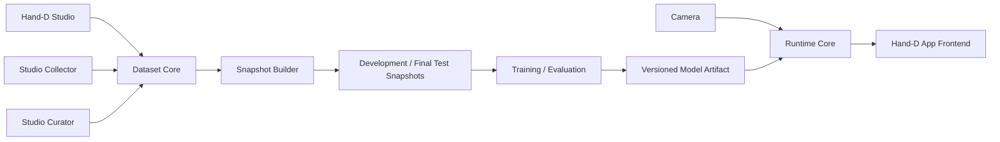
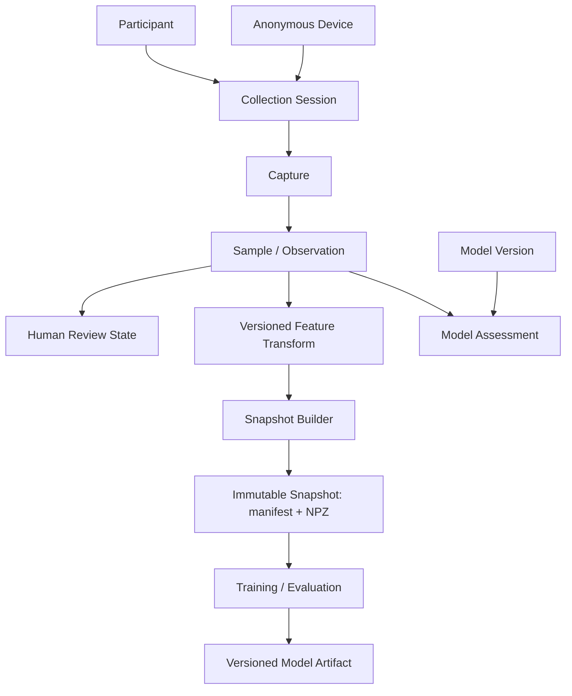

# Hand-D Architecture Reference

## Alcance

This reference separates **verified current architecture** from the **target v2 boundaries**. Target sections are design direction, not claims that the code already implements them.

## Estado actual

### Runtime application

`visualizer_app/main.py` owns the Tkinter application, user configuration, UI tick loop, camera/canvas rendering, and lifecycle of `GestureEngine`.

`visualizer_app/gesture_engine.py` currently owns:

- webcam capture;
- MediaPipe Hand Landmarker creation;
- per-frame synchronous `detect(...)`;
- handedness correction and drawing/modifier role assignment;
- landmark canonicalization;
- PyTorch gesture inference;
- delivery of `GestureResult` to the UI.

The current classifier is a 69 → 128 → 64 → 5 MLP. Its runtime backend is CUDA when `torch.cuda.is_available()`, otherwise CPU.

### Data collection

`dataset_extraction_tools/data_extractor.py` captures webcam frames, processes every configured stride, canonicalizes a detected hand, and appends feature rows to a CSV. The CSV stores 69 features plus handedness and label.

The collector currently contains inconsistent handedness semantics: filtering compares the requested hand to MediaPipe's raw label, while the feature function separately computes the actual hand as the opposite label after mirror correction.

### Dataset curation

`dataset_extraction_tools/data_view_3d.py` is an interactive Matplotlib viewer/purger over the CSV representation. Its current save path is not a durable curation model; v2 will replace destructive row editing with review-state-driven dataset generation.

### Training

`model_training/gesture_classifier.py` is stale relative to the runtime:

- it defines four classes rather than the current five;
- it performs row-level random splitting;
- its validation loader points to the training subset;
- its CPU fallback expression is invalid;
- it does not provide a reproducible participant/session-aware evaluation protocol.

This file is evidence of technical debt, not a canonical training specification.

## Target v2 boundaries



### Hand-D App

The App is the product surface. It consumes processed runtime results and drawing state. It should not own ML training, dataset curation, or direct knowledge of training storage.

### Runtime Core

The runtime owns camera access, MediaPipe processing, shared feature transformation, gesture inference, temporal gesture behavior, hardware backend selection, and lifecycle/error states. The App frontend consumes results from this boundary.

For the App path, freshness is more important than exhausting every camera frame.

Live camera processing uses MediaPipe Hand Landmarker LIVE_STREAM mode and detect_async with monotonic timestamps. Unlike the current IMAGE/detect loop, the live-stream API is asynchronous and is allowed to ignore incoming frames while the landmarker is busy. This bounded/freshness behavior is intentional: Hand-D must prefer the latest usable gesture state over building a backlog of stale camera frames.

VIDEO mode remains available for decoded/recorded video workloads; it is not the primary webcam runtime because detect_for_video is synchronous. IMAGE mode remains for isolated images/tests.

Conceptually the live path is:

Camera capture -> latest-frame boundary -> MediaPipe LIVE_STREAM -> latest landmark result -> Feature Transform -> gesture inference -> temporal state -> frontend result/events.

Every boundary that can accumulate live work must remain bounded/freshness-oriented rather than becoming an unbounded FIFO. Preview rendering is a separate consumer of the latest camera frame and is never upstream of inference.

The real-time system has three independent cadences:

- **Camera/source cadence**: whatever the selected camera mode actually delivers, probed at runtime rather than assumed.
- **Inference cadence**: MediaPipe/gesture updates, targeting source cadence up to 60 Hz when feasible, with >=30 Hz preferred on capable supported hardware and sustained <20 Hz treated as degraded.
- **Frontend render cadence**: normally 60 Hz on the milestone displays, consuming the latest gesture/tracking state independently from inference frequency.

Hand-D never duplicates camera frames merely to claim 60 FPS and never treats a 60 Hz canvas loop as evidence of 60 Hz inference.

The post-landmarker gesture-response budget is p95 <50 ms preferred and p95 <100 ms as the milestone hard ceiling, measured from a usable MediaPipe result entering Feature Transform through model inference, temporal state, IPC, and frontend state delivery. Camera/sensor latency is recorded separately when reliable capture timestamps are available.

### Tauri + Python sidecar

Tauri/Rust owns the Python sidecar as a long-lived child process. Rust is responsible for spawn, readiness/health, crash/exit observation, log capture, restart policy, and orderly shutdown. Frontend components use application-level commands/events and do not directly own process creation.

Runtime lifecycle is resilient rather than modal. The Tauri shell/frontend is allowed to become interactive before Python, MediaPipe, the model, and camera are fully ready. Runtime-dependent affordances expose preparing/recovering/degraded states while canvas and non-runtime UI remain available.

On unexpected sidecar exit, Rust performs one automatic restart attempt. Frontend/canvas state is not reset as a side effect of restarting Python. If the restarted sidecar reaches READY, normal runtime subscriptions resume; if recovery fails, the shell remains open and exposes an explicit retry action.

Health is modeled by subsystem rather than as one boolean. At minimum the frontend can distinguish sidecar/process health, IPC connection, model readiness, camera availability/permission, and preview state. A camera-specific failure does not imply that the shell, canvas, settings, or already-loaded model metadata must be discarded.

The milestone IPC direction is a loopback HTTP + WebSocket service hosted by Python. HTTP is suitable for request/response operations such as health/configuration and WebSocket carries low-latency runtime events and interactive commands. The service binds only to loopback; the prototype must define dynamic port discovery, per-launch trust/authentication, Tauri capability/CSP scopes, reconnect semantics, protocol versioning, and shutdown behavior.

Endpoint discovery uses OS allocation rather than a fixed port. Python binds to 127.0.0.1:0, reads back the assigned port, and reports it to Tauri/Rust in the sidecar readiness handshake. Tauri/Rust supplies a fresh random launch token to the sidecar and exposes connection information only to the Hand-D frontend/runtime bridge. Restarting the sidecar creates a new endpoint/session rather than assuming that a previous port remains valid.

This localhost service is the Python sidecar API; it is distinct from Tauri's optional localhost plugin for serving frontend assets.

### Camera preview

Both App and Studio may display live camera preview, preserving the current camera-visible/dark-mode product behavior. Studio uses preview as collection feedback; App treats it as an optional presentation mode.

Preview is deliberately independent from control/inference IPC. Python owns the camera once and can fan the latest frame out to MediaPipe and to an optional preview encoder/stream. When no surface subscribes to preview, frame encoding/transport work should stop.

The selected v2 preview path is HTTP MJPEG served directly by the Python sidecar on its authenticated loopback endpoint. The Tauri webview consumes this as an image stream, so frame bytes do not traverse Tauri command/event IPC and do not require application-level JavaScript decoding/reassembly. Preview never shares a backpressure queue with gesture/control events.

MJPEG is tuned/measured on Tiger Lake/CachyOS and Apple Silicon M4. Priority is ordered as gesture latency, tracking/inference stability, visual preview smoothness, then preview resolution/FPS. A dedicated binary WebSocket JPEG stream is retained only as contingency if direct MJPEG later fails an explicit supported-target budget.

Preview cadence is source/capability-driven. If a camera exposes a stable 60 FPS mode and the machine can preserve the gesture-response budget, Hand-D may stream preview at up to 60 FPS. Otherwise the baseline target is a stable 30 FPS and the normal visible-preview floor is 24 FPS. Under load the runtime reduces JPEG quality/resolution first, then preview FPS, and can suspend hidden/minimized preview encoding before compromising gesture freshness.

WebRTC is not the baseline transport for the milestone because Hand-D needs consistent behavior across Tauri's platform webviews and current WebKitGTK 2.54 disables WebRTC while transitioning backends. Codec/MSE/WebCodecs pipelines may become relevant later if high-resolution preview efficiency becomes more important than the simplicity and portability of MJPEG.

The existing project inspirations in README.md — BaranDev/virtual-whiteboard and the dark-mode hand-tracking demo — remain qualitative interaction references. FaceRay is an explicit architecture inspiration: its Tauri 2 + Python/MediaPipe design keeps CV/video in the Python data plane and serves loopback MJPEG directly to the webview so heavy frame bytes do not cross the control IPC boundary. Hand-D adopts that data-plane separation, while retaining its own HTTP/WebSocket control protocol and model/runtime requirements.

### Hand-D Studio

Studio is a developer-facing surface for:

- participant selection;
- collection sessions/captures;
- dataset inspection;
- Suggested for Review;
- accepted/rejected curation;
- dataset export/preparation.

Training/evaluation should be invokable reproducibly from tooling/CLI for the milestone, but is not required inside the Studio GUI.

### Dataset Core

The canonical observation is raw landmark data plus provenance and human labeling/review state. The canonical working store is SQLite so Studio can query, curate, and update this state transactionally. A versioned transform produces the feature representation used by a specific model.

Conceptual relationships:



The operator should only need to choose participant, gesture, hand, and collection target. Session IDs, capture IDs, timestamps, anonymous device identity, platform, camera, and relevant versions are generated/recorded automatically.

Canonical landmark storage is relational at the current scale:

```text
samples
└── sample_id

landmarks
├── sample_id
├── landmark_index        # 0..20
├── image_x / image_y / image_z
└── world_x / world_y / world_z
```

One Sample therefore owns exactly 21 landmark rows. This representation is intentionally inspectable and testable; vectorized arrays are produced later by the feature/snapshot pipeline.

### Capture lifecycle

A Capture represents one continuous collection context inside a Collection Session. It may be paused and resumed while that Session remains active. If the Session ends, an incomplete Capture remains partial and a later Session starts a new Capture.

An incomplete Capture that has never been referenced by an immutable snapshot may be explicitly discarded and physically deleted with its Samples. Once data is referenced by a snapshot, destructive cleanup must not invalidate the snapshot's ability to reproduce the historical training/evaluation view.

### Feature Transform seam

Feature canonicalization is a shared deep module. Its interface exposes the transform identity/version and the model-ready output contract; mirror correction, translation, scale normalization, canonical-frame rotation, global orientation features, and validation remain implementation details behind the seam.

The current legacy-compatible transform produces the existing 69-value feature contract. New raw Samples can be reprocessed through this transform or through future transforms because their image/world landmarks are preserved. Legacy CSV rows do not have raw landmarks, so they can only participate where their stored 69-feature representation is contract-compatible.

Snapshots reference the Feature Transform contract used to materialize model input; they do not duplicate or expose the transform's internal geometry algorithm.

### Snapshot Builder

Snapshot Builder is the boundary between mutable Dataset Core state and reproducible ML execution. It reads an approved historical view from SQLite, applies the selected Feature Transform exactly once during materialization, and emits an immutable snapshot. Training/evaluation does not query SQLite directly after the snapshot exists.

The milestone snapshot consists conceptually of a manifest.json plus dataset.npz.

The manifest records the snapshot identity, selected Sample membership, participant/session membership, label order, Feature Transform identity/version/output contract, session-validation fold definitions, legacy availability/membership, seed/reproducibility configuration, and source revision/integrity metadata.

The NPZ contains the exact materialized model inputs associated with that manifest, including feature arrays, labels, stable source identifiers, and split/fold metadata needed by training/evaluation. For v2 Samples these arrays are derived from canonical raw landmarks at snapshot creation. Compatible legacy rows remain a separate materialized partition because they have only the existing derived 69-feature contract and cannot be regenerated through future incompatible transforms.

The Development Snapshot is shared across the P001/P002 development protocol. It freezes the v2 development materialization, compatible legacy materialization, and fixed Collection-Session folds. Selecting a fold, choosing legacy=false or legacy=true, and choosing a learning-curve fraction are experiment configuration over this same immutable evidence base rather than separate independently-created datasets.

This guarantees that with-legacy and without-legacy comparisons change the intended variable instead of silently changing validation membership.

P003 is never materialized into the Development Snapshot. Once all development/model-selection decisions are frozen, Snapshot Builder may create a separate Final Test Snapshot for P003 and that snapshot is used for the single held-out final evaluation.

An existing snapshot is self-contained for ML execution. Later SQLite review changes or Feature Transform implementation changes do not alter its manifest or materialized NPZ. New canonical decisions require a new snapshot.

Immutability is enforced by creation semantics rather than filesystem permissions: Snapshot Builder never overwrites an existing snapshot ID. If membership, transform, folds, or materialized content changes, it allocates a new snapshot version.

### Model Artifact

Training output is a versioned bundle rather than an unqualified weights file. The milestone bundle consists conceptually of weights.pth, manifest.json, and metrics.json.

The model manifest declares, at minimum:

- model identity and architecture/version;
- Feature Transform identity/version and expected output contract;
- expected input dtype/feature count;
- label mapping/order;
- source Development Snapshot identity;
- training configuration and seed information;
- legacy inclusion policy and relevant experiment configuration;
- compatibility/runtime metadata.

The metrics document carries the evaluation evidence associated with the artifact, including aggregate session-cross-validation Macro F1, accuracy, per-class precision/recall/F1, confusion-matrix data, learning-curve summary, and other promotion evidence produced by the finalized protocol.

Runtime treats the model manifest as a compatibility contract. It validates the expected Feature Transform/input and label mapping before loading the model for inference. A dimensionally compatible but semantically incompatible model must not be allowed to run merely because its tensor shape happens to match.

Model Artifact creation follows the same rule: an existing model version is never replaced in place. A new training output receives a new model ID/version.

### Model Assessment

Prediction confidence and class scores belong to the pair **sample + model version**, not permanently to the sample itself. Model disagreement or low confidence can prioritize review, but does not imply invalid data.

Each assessment references the exact Model Artifact that produced it. Studio may designate one model version as the current review model for a curation pass, but historical assessments from prior models remain immutable and queryable.

The first uncertainty ranking uses the margin between the top two class scores. A low margin indicates that the model's decision is ambiguous relative to its nearest competing class; the threshold is calibrated from development-validation behavior rather than treated as a universal probability claim.

Suggested for Review is exposed as a ranked queue: explicit model disagreement ranks ahead of otherwise-correct but low-margin predictions. The stored Model Assessment keeps the underlying scores/margin; any UI review budget or cutoff is a view over that evidence rather than a mutation of the Sample.

### Curation state

Human curation is represented by an append-only Review Event history plus an efficiently queryable current Review Status. Automatic signals may prioritize a Sample in Suggested for Review but do not mutate its human review state.

Rejection annotation is optional. Studio exposes a small default tag vocabulary for common causes and permits custom tags when new failure modes appear. Tags are review context rather than Sample truth, and an optional free-form note may accompany them.

Rejected Samples remain part of the canonical historical dataset and are filtered out when eligible snapshot membership is materialized. Physical deletion is reserved for the previously defined explicit discard path for incomplete, snapshot-unreferenced Captures.

Review changes never rewrite an existing immutable snapshot. They affect eligibility only when a later snapshot is created.

### Platform backend policy

CPU is always a valid fallback.

Preferred acceleration is capability-driven:

- NVIDIA: CUDA where supported;
- Apple Silicon: MPS where supported;
- AMD: ROCm only on supported hardware/OS/runtime combinations;
- Intel: PyTorch XPU only on validated hardware/runtime combinations.

Vendor SDK support alone is not enough to claim that Hand-D supports a PyTorch backend on a given machine.

### Platform/runtime matrix

The intended v2 desktop matrix is:

- **Linux x86-64** — first-priority development/validation target; CPU baseline on the current Tiger Lake/CachyOS host, with optional acceleration only when a supported PyTorch backend is actually present.
- **macOS arm64** — first-priority lab target; Apple Silicon CPU + MPS validation on the M4 lab machines.
- **Windows x86-64** — supported v2 target, but validated after Linux/macOS because no equivalent always-available Windows test host is part of the primary development loop.

Tauri external sidecars are target-specific binaries, so each supported target receives its own packaged Python executable and native Tauri build. PyInstaller is not treated as a cross-compiler: Windows artifacts are built on Windows, macOS artifacts on macOS, and Linux artifacts on Linux.

Native CI follows the same rule using standard GitHub Actions runners for Linux, macOS, and Windows. CI validates buildability, tests, sidecar startup/READY behavior, and packaging per operating system. Camera/device behavior remains a hardware smoke-test concern and is not falsely inferred from CI alone.

The milestone Python runtime is **Python 3.13**. This is a project/runtime constraint rather than a host-OS constraint; developers may run newer system Python versions while Hand-D's environment/build tooling provisions 3.13.

### Installed application vs Project Workspace

Packaging does not define Hand-D's data lifecycle. There are two independent locations:

1. **Installed application/resources** — Tauri shell, packaged Python sidecar, static UI assets, MediaPipe task resources, and optionally a read-only default/fallback Model Artifact.
2. **Project Workspace** — writable project state: canonical SQLite dataset, snapshots, generated Model Artifacts, reports, and other mutable ML/data outputs.

The Project Workspace is never placed inside the installed app bundle. Studio opens/selects it explicitly so collection and curation remain compatible with the team's sequential Git ownership workflow. Development-from-source and installed builds can point at the same workspace when intentionally configured to do so.

Retraining therefore produces a new workspace Model Artifact rather than modifying packaged resources. Runtime resolves the active model from compatible workspace artifacts, with the packaged model available as a fallback/bootstrap artifact where appropriate.

Normal preferences/cache/logs may use the platform application-data directories, but those are distinct from the project dataset/workspace. Tauri's writable app-data paths are appropriate for application-owned state; the canonical team dataset remains an explicit project/workspace concern.

### MediaPipe migration gate

The move from the current MediaPipe 0.10.x dependency to 1.1.x follows TDD:

1. Freeze executable contract tests against the currently relied-on behavior.
2. Verify task-model loading and LIVE_STREAM/detect_async callback semantics.
3. Assert 21 normalized image landmarks and 21 world landmarks for valid detections.
4. Assert handedness conversion semantics and monotonic timestamp handling.
5. Assert that shared Feature Transform v1 still produces the expected float32[69] contract for compatible fixtures.
6. Upgrade MediaPipe/runtime integration.
7. Make the same tests pass without weakening assertions merely to accommodate the upgrade.
8. Run Linux x86-64 and macOS arm64 smoke/performance checks first, then Windows x86-64 packaging/smoke validation.

The dependency version is pinned only after this compatibility gate succeeds. A failed gate is evidence to remain temporarily on the current compatible line rather than forcing a migration for novelty.

## Interfaces y datos

Target interfaces are conceptual until implementation begins:

- **Runtime result**: gesture labels, confidence/scores when available, hand identity/role, landmarks/tracking position, timing/health state, and optional preview data.
- **Canonical sample**: raw MediaPipe landmarks, target gesture, participant ID, hand, session/capture IDs, local provenance, timestamp/frame index, human review state.
- **Derived feature sample**: source sample ID, transform/version ID, model-compatible feature vector.
- **Model assessment**: source sample ID, model version, predicted label, confidence/class scores, evaluation timestamp.
- **Model artifact**: versioned weights plus manifest and metrics, including label order, input feature contract, Feature Transform version, architecture/version, source snapshot, experiment configuration, and compatibility information.
- **Development snapshot**: immutable manifest + NPZ materialization for P001/P002 development and compatible legacy data, with fixed session-validation folds, feature/label contracts, seed/configuration, and integrity/version information.
- **Final test snapshot**: separate immutable manifest + NPZ materialization for the sealed P003 evaluation after development choices are frozen.

SQLite is the canonical mutable working store. A snapshot freezes the exact training/evaluation view of that store. Its NPZ is the immutable materialized ML input for that snapshot, while SQLite remains the canonical source of collection provenance and evolving curation state. Regenerating a materially different NPZ/manifest creates a new snapshot rather than rewriting an existing one.

## Operación y límites

- No canonical sample stores a photo or video frame.
- Local collection provenance is not remote analytics telemetry.
- Legacy CSV data may be used for training, but cannot prove unseen-participant generalization.
- A third genuinely new participant is the preferred held-out final test participant.
- The primary collection path may use each participant's selected main hand; a smaller opposite-hand verification set checks the left/right normalization assumption.
- Tauri is the selected v2 desktop-shell direction. Python owns ML/runtime work as a packaged sidecar supervised by Tauri/Rust. Loopback HTTP + WebSocket is the selected control/result IPC direction, and authenticated loopback MJPEG is the selected preview transport. Exact protocol schema, reconnect behavior, and MJPEG quality/resolution/FPS remain implementation/performance-tuning details.

## Fuentes y verificación

| Afirmación | Fuente | Revisado el | Estado |
|---|---|---|---|
| Runtime performs synchronous `detect(...)` in its camera loop | `visualizer_app/gesture_engine.py:347-374` | 2026-10-05 | Verificado por source |
| Runtime MLP has five outputs and 69 input features | `visualizer_app/gesture_engine.py:157-178` | 2026-10-05 | Verificado por source |
| Runtime device policy is CUDA-or-CPU | `visualizer_app/gesture_engine.py:181-196` | 2026-10-05 | Verificado por source |
| Runtime model excludes handedness from its 69-feature input | `visualizer_app/gesture_engine.py:146-149` | 2026-10-05 | Verificado por source |
| MediaPipe handedness is used separately to assign drawing/modifier roles | `visualizer_app/gesture_engine.py:398-433` | 2026-10-05 | Verificado por source |
| Collector writes 69 features + handedness + label | `dataset_extraction_tools/data_extractor.py:197-207` | 2026-10-05 | Verificado por source |
| Curator drops a row in memory, then concatenates the original file back during save | `dataset_extraction_tools/data_view_3d.py:181-204` | 2026-10-05 | Verificado por source |
| Training script is currently four-class and row-random-split | `model_training/gesture_classifier.py:43-86` | 2026-10-05 | Verificado por source |
| Target App/Studio/data boundaries | `docs/changes/hand-d-v2-modernization.md` | 2026-10-05 | Decisión aprobada, aún no implementada |
| MediaPipe Hand Landmarker LIVE_STREAM/detect_async() is designed for camera input, returns asynchronously, and may drop input images to reduce latency | https://ai.google.dev/edge/api/mediapipe/python/mp/tasks/vision/HandLandmarker | 2026-10-06 | Verificado en documentación oficial |
| FaceRay uses Tauri 2 + a Python/MediaPipe sidecar and serves loopback MJPEG directly to the webview so frame bytes do not cross Rust/TypeScript control IPC | https://github.com/aarontran321/FaceRay | 2026-10-06 | Precedente arquitectónico externo |
| WebKitGTK 2.54 disables WebRTC while its backend transitions from GStreamer WebRTC to LibWebRTC | https://webkitgtk.org/2026/09/16/webkitgtk-2.54-highlights.html | 2026-10-06 | Verificado en documentación oficial |
