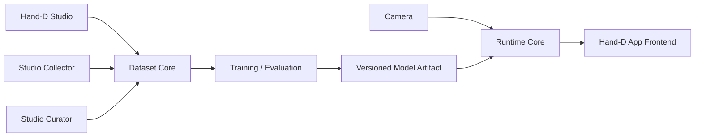
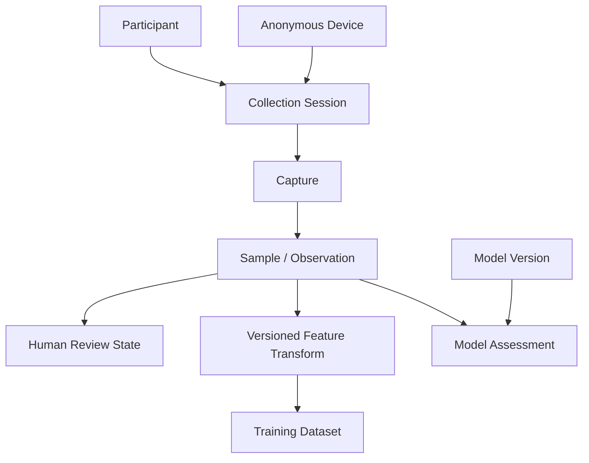

# Hand-D Architecture Reference

## Alcance

This reference separates **verified current architecture** from the **target v2 boundaries**. Target sections are design direction, not claims that the code already implements them.

## Estado actual

### Runtime application

`visualizer_app/main.py` owns the Tkinter application, user configuration, UI tick loop, camera/canvas rendering, and lifecycle of `GestureEngine`.

`visualizer_app/gesture_engine.py` currently owns:

- webcam capture;
- MediaPipe Hand Landmarker creation;
- per-frame synchronous `detect(...)`;
- handedness correction and drawing/modifier role assignment;
- landmark canonicalization;
- PyTorch gesture inference;
- delivery of `GestureResult` to the UI.

The current classifier is a 69 → 128 → 64 → 5 MLP. Its runtime backend is CUDA when `torch.cuda.is_available()`, otherwise CPU.

### Data collection

`dataset_extraction_tools/data_extractor.py` captures webcam frames, processes every configured stride, canonicalizes a detected hand, and appends feature rows to a CSV. The CSV stores 69 features plus handedness and label.

The collector currently contains inconsistent handedness semantics: filtering compares the requested hand to MediaPipe's raw label, while the feature function separately computes the actual hand as the opposite label after mirror correction.

### Dataset curation

`dataset_extraction_tools/data_view_3d.py` is an interactive Matplotlib viewer/purger over the CSV representation. Its current save path is not a durable curation model; v2 will replace destructive row editing with review-state-driven dataset generation.

### Training

`model_training/gesture_classifier.py` is stale relative to the runtime:

- it defines four classes rather than the current five;
- it performs row-level random splitting;
- its validation loader points to the training subset;
- its CPU fallback expression is invalid;
- it does not provide a reproducible participant/session-aware evaluation protocol.

This file is evidence of technical debt, not a canonical training specification.

## Target v2 boundaries

### Hand-D App

The App is the product surface. It consumes processed runtime results and drawing state. It should not own ML training, dataset curation, or direct knowledge of training storage.

### Runtime Core

The runtime owns camera access, MediaPipe processing, shared feature transformation, gesture inference, temporal gesture behavior, hardware backend selection, and lifecycle/error states. The App frontend consumes results from this boundary.

For the App path, freshness is more important than exhausting every camera frame.

### Hand-D Studio

Studio is a developer-facing surface for:

- participant selection;
- collection sessions/captures;
- dataset inspection;
- Suggested for Review;
- accepted/rejected curation;
- dataset export/preparation.

Training/evaluation should be invokable reproducibly from tooling/CLI for the milestone, but is not required inside the Studio GUI.

### Dataset Core

The canonical observation is raw landmark data plus provenance and human labeling/review state. A versioned transform produces the feature representation used by a specific model.

Conceptual relationships:

The operator should only need to choose participant, gesture, hand, and collection target. Session IDs, capture IDs, timestamps, anonymous device identity, platform, camera, and relevant versions are generated/recorded automatically.

### Model Assessment

Prediction confidence and class scores belong to the pair **sample + model version**, not permanently to the sample itself. Model disagreement or low confidence can prioritize review, but does not imply invalid data.

### Platform backend policy

CPU is always a valid fallback.

Preferred acceleration is capability-driven:

- NVIDIA: CUDA where supported;
- Apple Silicon: MPS where supported;
- AMD: ROCm only on supported hardware/OS/runtime combinations;
- Intel: PyTorch XPU only on validated hardware/runtime combinations.

Vendor SDK support alone is not enough to claim that Hand-D supports a PyTorch backend on a given machine.

## Interfaces y datos

Target interfaces are conceptual until implementation begins:

- **Runtime result**: gesture labels, confidence/scores when available, hand identity/role, landmarks/tracking position, timing/health state, and optional preview data.
- **Canonical sample**: raw MediaPipe landmarks, target gesture, participant ID, hand, session/capture IDs, local provenance, timestamp/frame index, human review state.
- **Derived feature sample**: source sample ID, transform/version ID, model-compatible feature vector.
- **Model assessment**: source sample ID, model version, predicted label, confidence/class scores, evaluation timestamp.
- **Model artifact metadata**: label order, input feature contract, transform version, architecture/version, and compatibility information.

The exact serialization/storage format remains open.

## Operación y límites

- No canonical sample stores a photo or video frame.
- Local collection provenance is not remote analytics telemetry.
- Legacy CSV data may be used for training, but cannot prove unseen-participant generalization.
- A third genuinely new participant is the preferred held-out final test participant.
- The primary collection path may use each participant's selected main hand; a smaller opposite-hand verification set checks the left/right normalization assumption.
- The desktop shell remains deliberately undecided until prototype evidence exists.

## Fuentes y verificación

| Afirmación | Fuente | Revisado el | Estado |
|---|---|---|---|
| Runtime performs synchronous `detect(...)` in its camera loop | `visualizer_app/gesture_engine.py:347-374` | 2026-10-05 | Verificado por source |
| Runtime MLP has five outputs and 69 input features | `visualizer_app/gesture_engine.py:157-178` | 2026-10-05 | Verificado por source |
| Runtime device policy is CUDA-or-CPU | `visualizer_app/gesture_engine.py:181-196` | 2026-10-05 | Verificado por source |
| Runtime model excludes handedness from its 69-feature input | `visualizer_app/gesture_engine.py:146-149` | 2026-10-05 | Verificado por source |
| MediaPipe handedness is used separately to assign drawing/modifier roles | `visualizer_app/gesture_engine.py:398-433` | 2026-10-05 | Verificado por source |
| Collector writes 69 features + handedness + label | `dataset_extraction_tools/data_extractor.py:197-207` | 2026-10-05 | Verificado por source |
| Curator drops a row in memory, then concatenates the original file back during save | `dataset_extraction_tools/data_view_3d.py:181-204` | 2026-10-05 | Verificado por source |
| Training script is currently four-class and row-random-split | `model_training/gesture_classifier.py:43-86` | 2026-10-05 | Verificado por source |
| Target App/Studio/data boundaries | `docs/changes/hand-d-v2-modernization.md` | 2026-10-05 | Decisión aprobada, aún no implementada |
